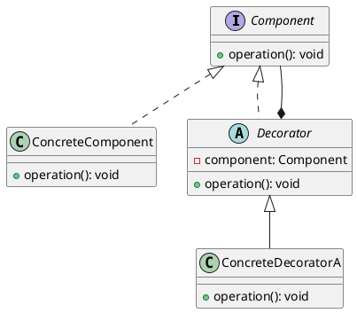
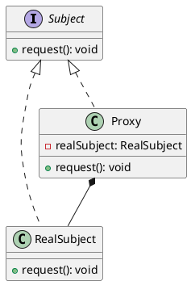

# Decorator Pattern
Sure! Here is the **description of the Decorator Design Pattern in English**, including its purpose, structure, and real-world applications.

---

## 📘 **1. Description of the Decorator Design Pattern**

The **Decorator Pattern** is a **Structural Design Pattern** that allows you to **dynamically add new behavior or responsibilities** to an object **without altering its original class**. It provides a flexible alternative to subclassing for extending functionality.

### 🧱 Core Components:

- **Component**: An interface or abstract class defining the methods that concrete objects and decorators must implement.
- **ConcreteComponent**: The original object that can be decorated.
- **Decorator**: An abstract class that holds a reference to a `Component` object and implements the `Component` interface.
- **ConcreteDecorator**: Classes that extend the `Decorator` and add new behaviors or responsibilities.

---

## ❓ **2. Questions to Ask to Decide Whether to Use the Decorator Pattern**

You should consider using the Decorator Pattern if you answer **"Yes"** to one or more of the following:

1. ✅ Do you want to **add behavior to an object at runtime**?
2. ✅ Do you want to **avoid creating multiple subclasses** to extend functionality (subclass explosion)?
3. ✅ Do you want to **combine behaviors in a flexible way** (e.g., stack multiple decorators)?
4. ✅ Do you have a base class and want to **extend it in different ways** without changing the core class?
5. ✅ Do you want to **modify the behavior of an object** without affecting other instances of the same class?

If so, the **Decorator Pattern** is a good fit.

---

## 🎯 **3. What is the Decorator Pattern Used For?**

- **Extending object functionality** at runtime.
- **Avoiding subclass explosion** (too many subclasses).
- **Providing more flexibility** than inheritance.
- **Wrapping objects** with additional responsibilities.
- **Building a pipeline** of behaviors (e.g., encryption, compression, logging).

---
## 🏢 **4. Real-World Applications of the Decorator Pattern**
1. **Graphical User Interfaces (GUIs)**: Adding scrollbars, borders, or other visual enhancements to UI components.
2. **Input/Output Streams**: In Java, classes like `BufferedInputStream` and `DataInputStream` decorate basic input streams to add functionality like buffering and data type conversion.
3. **Logging**: Adding logging functionality to existing classes without modifying their code.
4. **Data Compression**: Wrapping data streams with compression decorators to add compression capabilities.
5. **Authentication and Authorization**: Adding security checks to service calls without changing the service implementation.
6. **Text Processing**: Adding features like spell checking, formatting, or syntax highlighting to text editors.
7. **Web Development**: Middleware in web frameworks often uses the decorator pattern to add functionality to request/response handling.
8. **Game Development**: Adding abilities or power-ups to game characters dynamically.
9. **Notification Systems**: Adding different notification methods (email, SMS, push notifications) to a base notification service.
10. **Caching**: Wrapping data retrieval services with caching decorators to improve performance.
11. **E-commerce Systems**: Adding features like discounts, gift wrapping, or special offers to products dynamically.
12. **Middleware in Web Frameworks**: Many web frameworks use decorators to add functionality to request handlers, such as authentication, logging, or caching.
13. **Dependency Injection Frameworks**: Some DI frameworks use decorators to modify or enhance the behavior of injected services.
14. **Aspect-Oriented Programming (AOP)**: AOP frameworks often use decorators to add cross-cutting concerns like logging, security, or transaction management to existing classes.
15. **Plugin Systems**: Applications that support plugins often use decorators to add new features or modify existing behavior without changing the core application code.
16. **Middleware in Microservices**: In microservices architectures, decorators can be used to add cross-cutting concerns like logging, monitoring, or security to service calls.
17. **File Systems**: Virtual file systems may use decorators to add features like encryption, compression, or versioning to file operations.
18. **Audio Processing**: Adding effects like reverb, echo, or equalization to audio streams dynamically.
19. **Network Protocols**: Wrapping network connections with decorators to add features like encryption, compression, or logging.
20. **Robotics**: Adding sensors or capabilities to robots dynamically without changing the core robot class.
21. **Cloud Services**: Adding features like auto-scaling, load balancing, or monitoring to cloud services dynamically.
22. **Mobile Applications**: Adding features like analytics, crash reporting, or user tracking to mobile apps without modifying the core app code.
23. **Content Management Systems (CMS)**: Adding features like SEO optimization, social media sharing, or content scheduling to CMS components dynamically.
24. **E-learning Platforms**: Adding features like quizzes, progress tracking, or gamification to learning modules without changing the core module code.
25. **Financial Systems**: Adding features like fraud detection, transaction logging, or currency conversion to financial services dynamically.
26. **Healthcare Systems**: Adding features like patient monitoring, alerting, or data analytics to healthcare applications without modifying the core application code.
27. **IoT Systems**: Adding features like data aggregation, filtering, or alerting to IoT devices dynamically.
28. **Social Media Platforms**: Adding features like content moderation, user analytics, or recommendation engines to social media components without changing the core platform code.
29. **Gaming Engines**: Adding features like physics simulation, AI behavior, or rendering effects to game objects dynamically.
30. **DevOps Tools**: Adding features like logging, monitoring, or deployment automation to DevOps tools without modifying the core tool code.
31. **Chat Applications**: Adding features like message encryption, read receipts, or typing indicators to chat components dynamically.
32. **E-commerce Platforms**: Adding features like product recommendations, user reviews, or wish lists to e-commerce components without changing the core platform code.
33. **Data Analytics Platforms**: Adding features like data visualization, reporting, or machine learning to analytics components dynamically.
34. **Virtualization Platforms**: Adding features like resource allocation, load balancing, or monitoring to virtual machines without modifying the core virtualization code.
35. **Content Delivery Networks (CDNs)**: Adding features like caching, load balancing, or security to CDN components dynamically.
36. **Streaming Services**: Adding features like content recommendation, user analytics, or adaptive streaming to streaming components without changing the core service code.
37. **Collaboration Tools**: Adding features like real-time editing, version control, or commenting to collaboration components dynamically.
38. **Customer Relationship Management (CRM) Systems**: Adding features like lead scoring, email marketing, or customer analytics to CRM components without modifying the core system code.
39. **Enterprise Resource Planning (ERP) Systems**: Adding features like inventory management, order processing, or financial reporting to ERP components dynamically.
40. **Supply Chain Management Systems**: Adding features like shipment tracking, demand forecasting, or supplier analytics to supply chain components without changing the core system code.
41. **Human Resource Management Systems (HRMS)**: Adding features like performance tracking, payroll processing, or employee analytics to HRMS components dynamically.
42. **Learning Management Systems (LMS)**: Adding features like course recommendations, progress tracking, or gamification to LMS components without modifying the core system code.
43. **Project Management Tools**: Adding features like task dependencies, time tracking, or resource allocation to project management components dynamically.
44. **Email Clients**: Adding features like spam filtering, email encryption, or scheduling to email components without changing the core client code.
45. **Web Browsers**: Adding features like ad blocking, password management, or developer tools to browser components dynamically.
46. **Search Engines**: Adding features like autocomplete, spell checking, or personalized results to search components without modifying the core engine code.
47. **Virtual Assistants**: Adding features like voice recognition, natural language processing, or task automation to virtual assistant components dynamically.
48. **Blockchain Platforms**: Adding features like smart contracts, transaction analytics, or identity management to blockchain components without changing the core platform code.
49. **Augmented Reality (AR) Applications**: Adding features like object recognition, spatial mapping, or user interaction to AR components dynamically.
50. **Virtual Reality (VR) Applications**: Adding features like motion tracking, haptic feedback, or immersive audio to VR components without modifying the core application code.
51. **DevOps Pipelines**: Adding features like automated testing, code quality analysis, or deployment strategies to CI/CD pipelines dynamically.
52. **API Gateways**: Adding features like rate limiting, authentication, or logging to API gateway components without changing the core gateway code.
53. **Microservices Architectures**: Adding features like service discovery, load balancing, or circuit breaking to microservices dynamically.
54. **Data Warehousing Solutions**: Adding features like data cleansing, transformation, or aggregation to data warehousing components without modifying the core solution code.
55. **Content Management Systems (CMS)**: Adding features like version control, SEO optimization, or social media integration to CMS components dynamically.
56. **E-commerce Marketplaces**: Adding features like seller ratings, product recommendations, or dynamic pricing to marketplace components without changing the core platform code.
57. **Online Banking Systems**: Adding features like fraud detection, transaction analytics, or personalized financial advice to banking components dynamically.
58. **Telecommunication Systems**: Adding features like call recording, voicemail transcription, or spam filtering to telecommunication components without modifying the core system code.
59. **Transportation Management Systems (TMS)**: Adding features like route optimization, shipment tracking, or carrier analytics to TMS components dynamically.
60. **Energy Management Systems**: Adding features like demand forecasting, energy analytics, or grid optimization to energy management components without changing the core system code.

---
Great question! Here's a **detailed comparison** between **Decorator** and **Proxy** patterns, highlighting their key differences, purposes, and use cases.

---
## 🧩 **Decorator vs Proxy Pattern Comparison**

| **Aspect**                | **Decorator Pattern**                                    | **Proxy Pattern**                                      |
|---------------------------|----------------------------------------------------------|---------------------------------------------------------|
| **Purpose**               | **Adds behavior** to an object dynamically               | **Controls access** to an object                        |
| **Intent**                | Enhance or modify functionality of an object             | Provide a surrogate or placeholder for another object   |
| **When Used**             | At runtime to extend functionality                       | At access time to control object usage                  |
| **Object Creation**       | Wraps existing object to add behavior                    | Acts as a stand-in for the real object                  |
| **Client Awareness**      | Client may be aware of decoration (or not)               | Client is usually unaware of the proxy                  |
| **Responsibility**        | **Extends functionality**                                | **Controls access**                                     |
| **Usage Example**         | Adding bold/italic to text, adding logging to operations | Lazy loading, security, remote object access            |

---

## 🎯 **Decorator Pattern**

- **Goal**: Add new responsibilities to an object dynamically.
- **Structure**: Wraps the original object and delegates to it while adding behavior.
- **Example**: Wrapping a `Coffee` object with `MilkDecorator`, `SugarDecorator`, etc.

---

## 🎯 **Proxy Pattern**

- **Goal**: Control access to an object.
- **Structure**: Acts as a middleman between the client and the real object.
- **Types**:
    - **Virtual Proxy**: Delays expensive object creation.
    - **Remote Proxy**: Controls access to remote objects (e.g., RMI).
    - **Protection Proxy**: Controls access based on permissions.
    - **Smart Reference**: Adds behavior like reference counting.

---

## 🧪 **Visual Comparison**

### Decorator Example (Coffee)
```java
Coffee coffee = new SimpleCoffee();
coffee = new MilkDecorator(coffee);  // Enhanced with milk
coffee = new SugarDecorator(coffee); // Enhanced with sugar
```

### Proxy Example (Lazy Loading)
```java
Image image = new ProxyImage("photo.jpg"); // Not loaded yet
image.display(); // Now loads and displays
```

---

## 📐 **UML Comparison**

### Decorator UML


### Proxy UML


---

## 🧱 **Key Structural Differences**

| **Decorator**                     | **Proxy**                          |
|-----------------------------------|------------------------------------|
| Implements same interface as component | Implements same interface as subject |
| **Delegates to wrapped object**   | **Controls access to real object** |
| Can wrap multiple decorators      | Usually one proxy per subject      |
| **Extends functionality**         | **Controls behavior/access**       |

---

## ✅ **When to Use Which?**

### Use **Decorator** when:
- You want to **add behavior** to objects dynamically.
- You need to **combine behaviors** in flexible ways.
- You want to avoid **subclass explosion**.

### Use **Proxy** when:
- You want to **control access** to an object.
- You need **lazy initialization** or caching.
- You want to implement **security checks** or logging.
- You're dealing with **remote objects** or expensive resources.
