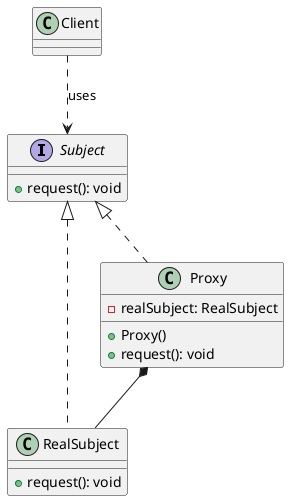

# 📘 **Proxy Pattern Description**

## **1. Overview**

The **Proxy Pattern** is a **Structural Design Pattern** that provides a **surrogate or placeholder** for another object to control access to it. The proxy acts as an intermediary between the client and the real object, allowing for additional behavior such as lazy initialization, access control, logging, or caching.

---

## **2. Structure Components**

- **Subject**: Interface or abstract class defining operations that both RealSubject and Proxy implement
- **RealSubject**: The actual object that performs the real work
- **Proxy**: Contains a reference to RealSubject and controls access to it

---

## **3. Types of Proxy**

### **Virtual Proxy**
- Controls access to expensive objects until needed
- Delays object creation until required
- **Example**: Loading a large image only when displayed

### **Remote Proxy**
- Provides local representative for object in different address space
- Handles network communication
- **Example**: RMI (Remote Method Invocation)

### **Protection Proxy**
- Controls access based on permissions
- Implements security checks
- **Example**: Admin vs User access control

### **Smart Reference Proxy**
- Adds behavior like reference counting or logging
- **Example**: Reference counting for memory management

---

## **4. When to Use Proxy Pattern**

Ask yourself these questions:

- ✅ Do you need to **control access** to an object?
- ✅ Do you want to **delay expensive object creation** (lazy loading)?
- ✅ Do you need **security checks** before accessing an object?
- ✅ Do you want to **add logging or caching** without modifying the real object?
- ✅ Are you working with **remote objects** or **expensive resources**?

---

## **5. Purpose and Benefits**

- **Control access** to the original object
- **Lazy initialization** of expensive objects
- **Security** and access control implementation
- **Performance optimization** through caching
- **Logging and monitoring** of object usage
- **Remote object handling** without client knowledge

---

## **6. Real-World Examples**

- Virtual Proxy:
  1. Image loading in web applications
  2. Document preview generation
  3. Database connection pooling
  4. Large file handling
  5. Video streaming buffering
  6. Game asset loading
  7. Virtual memory management
  8. Lazy-loaded configuration settings
  9. On-demand report generation
  10. Deferred UI component rendering
  11. Cloud resource allocation
  12. Lazy initialization of services
  13. Deferred computation results
  14. Lazy loading of user profiles
  15. On-demand data fetching
  16. Lazy loading of plugins
  17. Deferred analytics processing
  18. Lazy loading of large datasets
  19. On-demand API calls
  20. Lazy loading of multimedia content
  21. Deferred task execution
  22. Lazy loading of third-party libraries
  23. On-demand feature activation
  24. Lazy loading of UI themes
  25. Deferred initialization of game levels
  26. Lazy loading of machine learning models
  27. On-demand loading of language packs
  28. Lazy loading of user settings
  29. Deferred loading of analytics dashboards
  30. Lazy loading of social media feeds
- Remote Proxy:
  1. Remote Method Invocation (RMI)
  2. Web service clients
  3. Distributed object systems
  4. Remote database access
  5. Cloud service proxies
  6. Remote file access
  7. Networked game clients
  8. Remote logging services
  9. Remote caching services
  10. Remote configuration management
  11. Remote monitoring tools
  12. Remote backup services
  13. Remote authentication services
  14. Remote data synchronization
  15. Remote API gateways
  16. Remote job scheduling
  17. Remote notification services
  18. Remote analytics processing
  19. Remote content delivery networks
  20. Remote collaboration tools
  21. Remote virtual machines
  22. Remote desktop applications
  23. Remote IoT device management
  24. Remote blockchain nodes
  25. Remote AI model serving
  26. Remote video conferencing
  27. Remote code execution environments
  28. Remote data visualization tools
  29. Remote customer support systems
  30. Remote e-commerce platforms
- Protection Proxy:
  1. File system access control
  2. Database access permissions
  3. User authentication systems
  4. Role-based access control
  5. Secure API gateways
  6. Parental control software
  7. DRM (Digital Rights Management)
  8. Secure messaging applications
  9. VPN (Virtual Private Network) services
  10. Secure cloud storage
  11. Encrypted communication channels
  12. Secure payment gateways
  13. Access control for IoT devices
  14. Secure remote desktop access
  15. Secure file sharing platforms
  16. Secure email services
  17. Secure social media platforms
  18. Secure online banking systems
  19. Secure healthcare data systems
  20. Secure government data portals

- Smart Reference Proxy:
  1. Reference counting for memory management
  2. Logging object access
  3. Caching frequently accessed data
  4. Tracking object usage statistics
  5. Automatic resource cleanup
  6. Monitoring object lifecycle
  7. Lazy loading with usage tracking
  8. Debugging object interactions
  9. Performance profiling
  10. Auditing object access
  11. Resource pooling management
  12. Automatic connection management
  13. Usage-based billing systems
  14. Object state monitoring
  15. Dynamic resource allocation
  16. Load balancing for shared resources
  17. Automatic failover handling
  18. Resource usage alerts
  19. Object version tracking
  20. Dynamic configuration management
  21. Automatic scaling of resources
  22. Resource usage optimization
  23. Object dependency tracking
  24. Dynamic feature toggling
  25. Automatic backup of object states
  26. Resource usage visualization
  27. Dynamic resource prioritization
  28. Automatic resource reclamation
  29. Object interaction logging
  30. Dynamic resource monitoring

---

## **8. UML Diagram (PlantUML)**

---

## **9. Proxy vs Other Patterns**

| **Pattern** | **Purpose** | **Proxy vs** |
|-------------|-------------|--------------|
| **Decorator** | Add behavior dynamically | Proxy controls access, Decorator extends functionality |
| **Adapter** | Make interfaces compatible | Proxy controls access, Adapter converts interface |
| **Facade** | Simplify complex interface | Proxy controls access, Facade simplifies interface |
